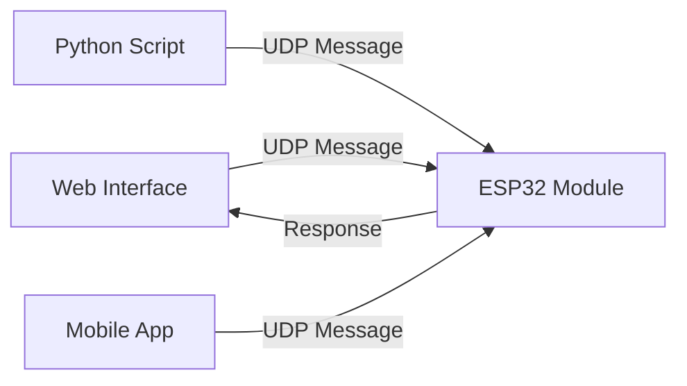

# Protocol Overview

The Qubi protocol is a UDP-based JSON communication system designed for real-time control of modular social robots. It provides low-latency, reliable communication between web interfaces and embedded devices.

## Core Concepts

### Modules

Qubi robots are built from **modules** - independent components that perform specific functions:

- **Actuator Modules**: Control physical movement (servos, motors, actuators)
- **Display Modules**: Manage visual output (eyes, facial expressions, LEDs)
- **Mobile Modules**: Handle robot movement and navigation
- **Sensor Modules**: Collect environmental data (temperature, distance, cameras)
- **Custom Modules**: User-defined functionality

### Commands

**Commands** are instructions sent to modules. Each command specifies:
- Which module to target (`module_id`)
- What type of module it is (`module_type`)
- What action to perform (`action`)
- Any required parameters (`params`)

### Messages

**Messages** are the top-level communication units that contain one or more commands, along with protocol metadata.

## Communication Flow



## Protocol Stack

| Layer | Purpose | Technology |
|-------|---------|------------|
| **Application** | Robot control logic | Your code |
| **Qubi Protocol** | Command structure & validation | JSON over UDP |
| **Transport** | Reliable delivery | UDP |
| **Network** | Routing | IP |
| **Physical** | Transmission | WiFi |

## Key Features

### 🚀 Low Latency
- UDP transport for minimal overhead
- Typical latency <10ms on local networks
- No connection establishment required

### 📦 Modular Design
- Standardized module types
- Extensible for custom functionality
- Independent module operation

### 🔧 Type Safety
- Full TypeScript definitions
- Runtime validation
- Clear error messages

### 🌐 Multi-Platform
- Web browsers (TypeScript/JavaScript)
- Embedded devices (Arduino/ESP32)
- Desktop applications (Python)
- Mobile apps (future support)

### 📊 Sequence Tracking
- Optional message sequencing
- Response correlation
- Timeout handling

## Message Structure

All Qubi messages follow this JSON structure:

```json
{
  "version": "1.0",
  "timestamp": 1699123456789,
  "sequence": 42,
  "commands": [
    {
      "module_id": "servo_01",
      "module_type": "actuator", 
      "action": "set_servo",
      "params": {
        "angle": 90,
        "speed": 128
      }
    }
  ]
}
```

### Required Fields

- **`version`**: Protocol version (currently "1.0")
- **`timestamp`**: Unix timestamp in milliseconds
- **`commands`**: Array of command objects

### Optional Fields

- **`sequence`**: Message sequence number for response tracking

## Response Structure

Modules send responses in this format:

```json
{
  "status": 200,
  "message": "Servo position set", 
  "module_id": "servo_01",
  "timestamp": 1699123456890,
  "data": {
    "angle": 90,
    "speed": 128
  }
}
```

### Status Codes

| Code | Meaning | Description |
|------|---------|-------------|
| **200** | Success | Command executed successfully |
| **400** | Bad Request | Invalid command format or parameters |
| **404** | Not Found | Module or action not found |
| **405** | Method Not Allowed | Action not supported by module |
| **500** | Internal Error | Module error during execution |

## Network Configuration

### Default Settings
- **Port**: 8888 (UDP)
- **Encoding**: UTF-8
- **Max Packet Size**: 1024 bytes
- **Timeout**: 5 seconds (configurable)

### Discovery
Modules can be discovered using broadcast messages to `255.255.255.255:8888` with a special discovery command.

## Security Considerations

### Network Security
- Use secure WiFi networks (WPA2/WPA3)
- Consider VPN for remote access
- Implement network segmentation for production

### Protocol Security
- No built-in encryption (use at network layer)
- Input validation on all parameters
- Rate limiting recommended for production

### Physical Security
- Secure device access
- Protect against physical tampering
- Consider emergency stop mechanisms

## Performance Characteristics

### Throughput
- **Typical**: 100+ messages/second
- **Burst**: 500+ messages/second (short duration)
- **Sustained**: 50-100 messages/second

### Latency
- **Local Network**: <10ms
- **Same Subnet**: <5ms
- **Cross-Router**: 10-50ms (depends on network)

### Memory Usage
- **ESP32**: <50KB for basic functionality
- **Message Buffer**: 1KB per message
- **Command Queue**: Configurable depth

## Compatibility

### Protocol Versions
- **1.0**: Current stable version
- Backward compatibility maintained within major versions
- Version negotiation for future extensions

### Hardware Support
- **ESP32**: Primary target platform
- **ESP8266**: Limited support (memory constraints)
- **Arduino Uno**: Not recommended (insufficient resources)

## Next Steps

- [Message Format](./message-format.md) - Detailed message specification
- [Error Handling](./error-handling.md) - Error codes and recovery
- [Module Types](../modules/actuator.md) - Explore specific module types